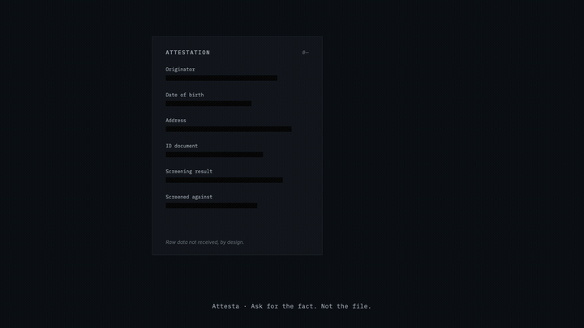
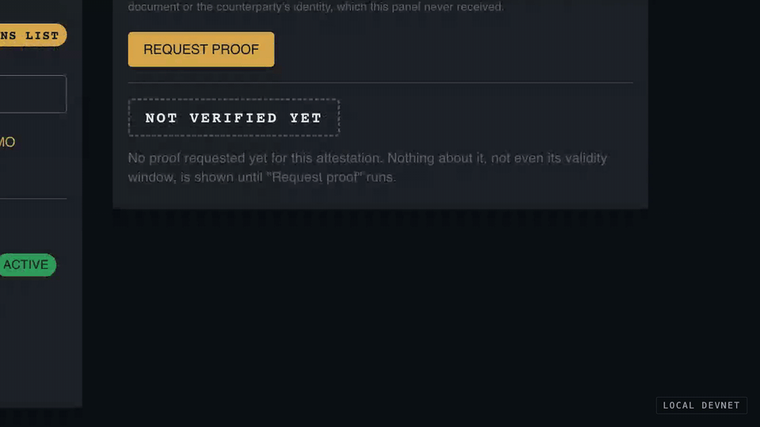
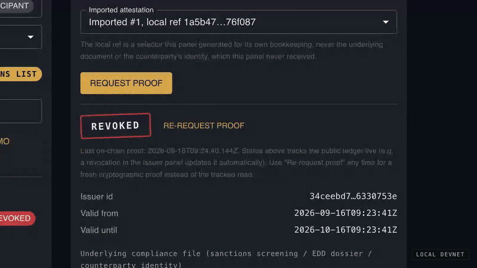

<p align="center">
  
</p>

<p align="center">
  
</p>

<div align="center">

  # Attesta

  ### Ask for the fact. Not the file.

  **Reusable proof that a compliance verification is still valid.**

  *Midnight Buildathon (AKINDO) · Wave 1*

  [](https://github.com/zzaved/Attesta/actions/workflows/ci.yaml)
  [](https://docs.midnight.network/compact/writing)
  [](https://www.typescriptlang.org/)
  [](#deployment-status-preprod)
  [](./LICENSE)

  [**Full documentation**](https://zzaved.github.io/Attesta/) · [What we built](https://zzaved.github.io/Attesta/what-we-built-in-wave-1) · [Architecture](https://zzaved.github.io/Attesta/architecture) · [Compact contract](https://zzaved.github.io/Attesta/compact-contract) · [How to run](https://zzaved.github.io/Attesta/how-to-run) · [Limitations](https://zzaved.github.io/Attesta/limitations) · [Roadmap](https://zzaved.github.io/Attesta/roadmap)

  ### [Live app](https://attesta-rx88.onrender.com) · [Demo walkthrough](https://zzaved.github.io/Attesta/demo-walkthrough) · [Usability validation](https://zzaved.github.io/Attesta/usability-validation)

</div>

---

## What this is

Attesta is a living registry of reusable compliance attestations, built on the
[Midnight Network](https://midnight.network/). A compliance officer asks a partner
institution to reconfirm a fact (sanctions clear, originator screened) and gets an
answer that is provably still valid *right now*, without ever receiving or storing the
file behind it. The raw data never leaves the issuer's side; only a commitment and a
validity window become public. Revocation is a first-class, *live* state change: an
attestation that verifies as `LIVE` verifies as `REVOKED` once its issuer revokes it,
with no page reload and no new request back to the issuer.

**Why it matters** ([full problem statement](https://zzaved.github.io/Attesta/the-problem)):

| Signal | What it shows |
|---|---|
| SWIFT KYC Registry: close to **6,000 financial institutions and 60+ central banks, across 200+ countries** | Verify-once, reuse-many already works, but only as closed infrastructure open to Registry members. |
| FATF Travel Rule (Recommendation 16), FATF 2026 report: **83%** of surveyed jurisdictions legislated it, only **40%** enforce it | The gap is infrastructure, not legislation: reconfirming a verification is expensive enough that, most of the time, it does not happen. |

The live app has a **"How to test this demo"** button in its header: a short in-app
walkthrough for anyone evaluating it without live guidance.

## See it working

| Verifier proves `LIVE`, raw data redacted | Issuer revokes, verifier proves again: `REVOKED` |
|---|---|
|  |  |

<sub>Both recordings were captured against the local devnet (`undeployed` network) with a
scripted browser; a small wallet bridge signs and submits each transaction with a real
wallet instead of the 1AM popup, and proof-generation waits are sped up. The
step-by-step click-through is on the [Demo Walkthrough](https://zzaved.github.io/Attesta/demo-walkthrough) page.</sub>

## How judges can test it

| Path | What you need | Steps |
|---|---|---|
| **A. Live app on `preprod`** | A Midnight wallet ([1AM](https://chromewebstore.google.com/detail/1am/bphnkdkcnfhompoegfpgnkidcjfbojjp), the wallet used on `preprod`), pointed at `preprod`, proof server set to `https://proof-server.preprod.midnight.network`, funded with tNIGHT and with DUST generated | Open [attesta-rx88.onrender.com](https://attesta-rx88.onrender.com), connect, paste `4f2cd18fd2c09aef3960f5159d29981fa4470a6bb26b2c1e0ce36537e6362f97` into **Join** (or use **Deploy** for a fresh instance). No Docker or local install. See [Public test network](#public-test-network-preprod). |
| **B. Local devnet** (`undeployed`, the primary environment) | Node 24, Docker, Compact 0.31.1, Lace | Follow [Reproducible setup](#reproducible-setup-local-devnet-undeployed): fully offline, no faucet, no testnet tokens. |
| **C. Automated checks only** | Node 24, Compact 0.31.1 | `npm install`, then `cd contract && npm run ci` (14 tests, compile-time leak check, typecheck, lint, build). |

On either network the demo cycle is the same, run with **two separate wallet
identities**: trust an issuer, register a demo attestation, export its proof packet,
import it as the verifier, prove it `LIVE`, revoke it from the issuer side, prove it
again and get `REVOKED`.

## How it works


1. **Register (issuer).** The issuer commits an attestation, a `persistentCommit` of the
   record (never the raw document), as a leaf of a `HistoricMerkleTree` of live
   attestations. The raw data never leaves the issuer's machine.
2. **Export the proof packet, once, out-of-band.** The packet carries `rawDataHash`,
   `validFrom`/`validUntil`, `issuerId`, `nullifierHash`, `salt`, and the already-public
   `commitment` (needed only to locate the leaf in the indexer): everything the verifier
   needs to run the proof itself, later, as many times as it wants. `issuerSecret` and
   `revocationSecret`, which let someone *mint or revoke* as the issuer, never leave the
   issuer's side and never enter the packet.
3. **Verify, locally, repeatedly (verifier).** The verifier imports the packet, fetches
   the *current* Merkle path from the public indexer, and runs `proveLive` on its own:
   membership in the live tree, a valid window, a trusted issuer, not revoked. It never
   depends on the issuer being online again. **Each `proveLive` is a real on-chain
   transaction: the verifier pays its DUST fee, the issuer pays nothing.**
4. **Revoke.** The issuer adds the attestation's nullifier to the public
   `revokedNullifiers` map. `proveLive` checks this map on every call, so a revoked
   attestation returns `REVOKED` on the next proof for every verifier holding its packet,
   with no coordination between them.
5. **`disclose()` is the only boundary.** Any witness value that reaches the public ledger
   or a circuit's return value has to pass through an explicit `disclose()`; its absence is
   a compile-time error ("Witness and Disclosure Errors"), not a runtime bug a reviewer
   might miss.

Deeper: [Architecture](https://zzaved.github.io/Attesta/architecture) (sequence
diagram, why revocation does not move the tree) and
[Compact Contract](https://zzaved.github.io/Attesta/compact-contract) (ledger,
circuits, the exact proof packet).

## Midnight integration

| Midnight feature | How Attesta uses it | Where |
|---|---|---|
| Compact contract (single contract, 4 circuits) | `registerAttestation`, `revokeAttestation`, `proveLive`, `setTrustedIssuer` | [`contract/src/attesta.compact`](./contract/src/attesta.compact) |
| `HistoricMerkleTree<10, Bytes<32>>` | Append-only set of live attestation commitments; membership proved in zero knowledge | [`attesta.compact`](./contract/src/attesta.compact) |
| `Map<Bytes<32>, Boolean>` ledger state | `revokedNullifiers` (public revocation set) and `trustedIssuers` (`SIMULATED TRUST LIST`) | [`attesta.compact`](./contract/src/attesta.compact) |
| `persistentCommit` / `persistentHash` | Commitment to the private record; pseudonymous `issuerId` and `nullifierHash` from secrets | [`attesta.compact`](./contract/src/attesta.compact) |
| Witness functions and private state | Raw-data hash, validity window, salts, secrets and Merkle path stay on the caller's side; issuer and verifier hold separate private state | [`contract/src/witnesses.ts`](./contract/src/witnesses.ts), [`bboard-ui/src/in-memory-private-state-provider.ts`](./bboard-ui/src/in-memory-private-state-provider.ts) |
| `disclose()` | Explicit private-to-public boundary, with a compile-time check that a leak fails the build | [`contract/src/test/verify-leak-fails-to-compile.mjs`](./contract/src/test/verify-leak-fails-to-compile.mjs) |
| `kernel.blockTimeLessThan` / `blockTimeGreaterThan` | Validity window checked against real chain time, not a caller-supplied clock | [`attesta.compact`](./contract/src/attesta.compact) |
| Midnight.js providers + DApp Connector API | Proof, indexer and ZK-config providers built from the connected wallet's own configuration (`getConfiguration()`) | [`bboard-ui/src/contexts/AttestaManager.ts`](./bboard-ui/src/contexts/AttestaManager.ts), [`api/src/index.ts`](./api/src/index.ts) |
| DUST fees | Every transaction, including each `proveLive`, is paid in DUST | [Gas note](#gas-note-dust-not-night) |

The UI side: [`IssuerPanel.tsx`](./bboard-ui/src/components/IssuerPanel.tsx),
[`VerifierPanel.tsx`](./bboard-ui/src/components/VerifierPanel.tsx),
[`proofPacket.ts`](./bboard-ui/src/proofPacket.ts). Why Midnight specifically:
[Why Midnight](https://zzaved.github.io/Attesta/why-midnight).

## What the five official Midnight repositories don't cover

| Repository | What it demonstrates | What it doesn't cover |
|---|---|---|
| [`example-zkloan`](https://github.com/midnightntwrk/example-zkloan) | One privacy-preserving credit decision; credit data stays on the applicant's machine | One fact, proved once. No revocation of a past decision, no path for a *second, independent* institution to reuse the proof later. |
| [`midnight-did`](https://github.com/midnightntwrk/midnight-did) | A reference `did:midnight` method | Identifier resolution, not the lifecycle of a fact asserted *about* an identity; no attestation going stale or revoked. |
| [`midnight-verifiable-credentials`](https://github.com/midnightntwrk/midnight-verifiable-credentials) | W3C issuer → holder → verifier structure | Assumes the holder re-presents each time; no reuse across *multiple, independent* verifiers, no live-revocation state a verifier can watch update. |
| [`midnight-trust-registry`](https://github.com/midnightntwrk/midnight-trust-registry) | In principle, "who is a legitimate issuer" | Created 2026-05-18, no README or substantial description found; maturity unknown. Even mature, it answers issuer trust, not live revocation or cross-verifier reuse. |
| [`midnight-passport-sdk`](https://github.com/midnightntwrk/midnight-passport-sdk) | Binding a proof to a physical identity document | A one-time binding, not an ongoing, revocable attestation a third party can reconfirm months later. Created 2026-07-30, unconfirmed maturity. |

None of the five pairs a `HistoricMerkleTree` of live attestations with a public
nullifier set that revocation writes to, so that "this attestation, issued months ago,
is still good" (or isn't) is a fact anyone holding the proof packet can check,
indefinitely, without asking the issuer again. Full comparison:
[Difference From Existing Examples](https://zzaved.github.io/Attesta/difference-from-existing-examples).

## What's simulated in this demo

Binary rule: a list here is labeled `SIMULATED` identically on screen, in this README,
and in the video, or the phrase "reuse across institutions" does not appear anywhere in
our submission material.

| Label | What it is |
|---|---|
| `SIMULATED TRUST LIST` | The issuer panel's trusted issuers are a small demo list of fictitious institutions ([`IssuerPanel.tsx`](./bboard-ui/src/components/IssuerPanel.tsx)). Real issuer governance is not solved in this Wave. |
| `DEMO PARTICIPANT` | Every counterparty named in the demo is fictitious, labeled next to its name everywhere it appears. |
| `SIMULATED SANCTIONS LIST` | Selecting "Sanctions screening (OFAC/EU/UN lists)" shows this badge and a note that the check is not connected to any real OFAC/EU/UN list: demo dataset only, not a live feed. |

Any claim of "reuse between institutions" refers only to what the demo shows: one
issuer, one verifier, real transactions, real proofs, on the local devnet and `preprod`,
not a real second institution using Attesta today. Full inventory:
[What We Built In Wave 1](https://zzaved.github.io/Attesta/what-we-built-in-wave-1).

## What we haven't solved yet

Renata, the head-of-risk/CCO persona whose sign-off this product ultimately needs, asks:
*"If I accept this proof instead of doing my own diligence, who's on the hook if it's
wrong, and how do I audit the verifier who validated it?"*

We don't know yet. Wave 1 answers "is this specific attestation still live", not "did
the *process* that produced hundreds of these attestations follow policy". That is the
biggest open question between this product and institutional adoption.

The plan: in Wave 2, Attesta will add an audit layer built on the same commitment/Merkle
primitives already shipped, with no rewrite. Each verifier check will generate a private
receipt (checklist item, declared risk level, outcome, timestamp, committed the same way
an attestation is), accumulated in a `HistoricMerkleTree` per period. An auditor will be
able to request a single proof that a batch of N receipts satisfied a declared policy
(e.g. "risk above this threshold implies enhanced due diligence was applied") without
opening any individual case. That will answer Renata's question partially: one fixed
policy is a proof of concept for a *class* of policy, not a general answer to "who
audits the verifier". See [Roadmap](https://zzaved.github.io/Attesta/roadmap).

## Limitations

The same list, word for word wherever possible, in this README, in the video, and in the
submission form:

1. The trusted-issuer list and the sanctions list are `SIMULATED`. Real issuer governance
   is not resolved in this Wave: `setTrustedIssuer` is unauthenticated on purpose for the
   demo, so any wallet can add or remove an issuer on the `SIMULATED TRUST LIST`.
2. The question "who audits the verifier?" (Renata, our blocking persona) is not answered
   in Wave 1. The sketch of an answer, the audit layer described above, is declared
   roadmap for Wave 2, on the same cryptographic core, not a vague promise.
3. Business validation is real, but limited in scope. Four structured usability sessions
   were run with real compliance and privacy professionals outside the team (see
   [Usability Validation](https://zzaved.github.io/Attesta/usability-validation)
   for the full protocol, findings, and the parts of those sessions that pushed back on
   this project's own thesis rather than confirming it). What this is not: a commercial
   pilot, a paying customer, or engagement with an institution's formal procurement or
   compliance-approval process. No institution, auditor, or regulator has adopted or
   endorsed this product: the four sessions are real signal from real people in the
   target role, reported as exactly that, not inflated into "validated with the market."
   Widening this is a named next step, not left open-ended: see
   [Adoption Path](https://zzaved.github.io/Attesta/adoption-path).
4. Attesta's network-effect argument (parallel to the SWIFT KYC Registry) is a thesis,
   not a demonstrated fact, for as long as there is no at least one real adoption signal
   outside the team: generating that signal is exactly what
   [Adoption Path](https://zzaved.github.io/Attesta/adoption-path)'s pilot plan
   targets.
5. `midnight-trust-registry` and `midnight-passport-sdk` have unknown maturity: created
   weeks before the hackathon, with no README or substantial description we could find.
   Any future integration with them depends on a maturity confirmation not yet made.
6. The issuer panel received the minimum UX budget, by conscious decision: UX time went
   to the verifier panel, which is what this product's core emotional journey (and the
   UX judging criterion) needs most.
7. Neither panel has a production deployment yet, and won't until a security audit
   happens. Both are fully built and tested end to end against Midnight's local devnet
   (`Undeployed`), the environment this project's cut-off condition was measured
   against. The contract is also deployed to `preprod`, a public test network (see
   "Deployment status" below for exactly which transactions exist there). What hasn't
   happened: long-running production operation, a security audit, or
   exposure to adversarial load, and none of those are skipped going forward: see
   [Roadmap](https://zzaved.github.io/Attesta/roadmap#production-deployment-gated-on-a-security-audit)
   for the explicit commitment that a security audit precedes any deployment handling
   real institutional data, not just a public testnet demo.
8. `proveLive` is not unlinkable across calls. To check revocation, trust and the
   validity window against real chain state, it discloses the attestation's
   `nullifierHash`, `issuerId`, `validFrom` and `validUntil` on every call. An observer can
   therefore tell that two `proveLive` transactions concern the same attestation, and
   link them to a later revocation (which publishes the same `nullifierHash`). The raw
   data and the tree position still never leave the witness side. Reducing this linkage
   is roadmap, not Wave 1.
9. The verifier's private state (imported proof packets) lives in memory: reloading the
   page loses it, and the packet has to be imported again.

Each item in detail: [Limitations](https://zzaved.github.io/Attesta/limitations).

## Reproducible setup (local devnet, `undeployed`)

The local devnet is Attesta's primary network, the one this project's cut-off condition
was measured against. Everything below runs offline against Docker containers: no
wallet funding, no faucet, no testnet tokens. Same steps, with more context:
[How To Run](https://zzaved.github.io/Attesta/how-to-run).

| Requirement | Verified version | Notes |
|---|---|---|
| Node.js | v24.14.1 (≥ 24.11.1, see [`.nvmrc`](./.nvmrc)) | `node --version` |
| Docker | 28.5.1 | `docker --version`, daemon must be running |
| Docker Compose | v2.40.2 (**v2 required**) | `docker compose version` |
| Compact compiler | **0.31.1** | Matches `@midnight-ntwrk/compact-runtime@0.16.0` pinned in `package-lock.json`, the pair the contract was compiled and tested against |

```bash
# 1. Compact toolchain manager + compiler
curl --proto '=https' --tlsv1.2 -LsSf \
  https://github.com/midnightntwrk/compact/releases/latest/download/compact-installer.sh | sh
compact update 0.31.1
compact compile --version   # expect: 0.31.1

# 2. Dependencies (npm workspaces, once, from the repo root)
npm install

# 3. Compile the contract and build the workspaces
cd contract && npm run compact && npm run build && cd ..
cd api && npm run build && cd ..
cd bboard-ui && npm run build && cd ..

# 4. Automated checks (14 tests + compile-time leak check + typecheck + lint + build)
cd contract && npm run ci && cd ..      # tests only: cd contract && npm test -- --run

# 5. Local node, indexer and proof server (leave running)
cd bboard-cli && npm run standalone

# 6. In a second terminal: the web app (defaults to VITE_NETWORK_ID=undeployed)
cd bboard-ui && npm run dev
```

**Expected results.**
- Step 1: if `compact update` fails with an extraction error, `unzip` is likely missing
  (the compiler ships as a `.zip`). Install it, or extract
  `~/.compact/versions/<version>/<target>/artifact.zip` into that directory and
  `chmod +x` the binaries.
- Step 3: `Compiling 4 circuits:` (`registerAttestation`, `revokeAttestation`,
  `proveLive`, `setTrustedIssuer`), no errors, and `contract/src/managed/attesta/{keys,zkir}`
  populated with prover/verifier keys.
- Step 4: **14 tests passing** ([`attesta.test.ts`](./contract/src/test/attesta.test.ts)),
  plus a `pretest` script ([`verify-leak-fails-to-compile.mjs`](./contract/src/test/verify-leak-fails-to-compile.mjs))
  proving that a witness value leaking without `disclose()` fails at **compile time**.
  See [Tests](https://zzaved.github.io/Attesta/tests).
- Step 5: starts the containers via `testcontainers` using
  [`bboard-cli/compose.yml`](./bboard-cli/compose.yml) (no manual `docker compose up`).
  First run pulls ~1.5 GB (`midnight-node`, `indexer-standalone`, `proof-server`) and
  takes about 90 seconds. It prints the endpoints (`networkId: "undeployed"`) and stays
  running, with no interactive menu ([`standalone.ts`](./bboard-cli/src/launcher/standalone.ts)).
  `Ctrl+C` tears the containers down (Ryuk reaper).

**Wallet for manual testing (Lace, `Undeployed` network).** A fresh wallet has 0
DUST/NIGHT and there is no faucet for `undeployed`. Restore a wallet from the public
**genesis seed**, which holds the tokens minted in every local devnet's genesis block:

```
0000000000000000000000000000000000000000000000000000000000000001
```

This is **not a secret**: it only has value on a devnet you started yourself, is the
same seed every `bboard`-style standalone setup uses, and means nothing on
`preview`/`preprod`/mainnet.

1. Keep `npm run standalone` running.
2. In Lace, restore a wallet from the seed above.
3. Set **Network** to **Undeployed**.
4. Set **Proof server** to `http://127.0.0.1:6300`. `compose.yml` pins `6300` (proof
   server), `9944` (node) and `8088` (indexer) to match Lace's defaults for `Undeployed`.
5. The wallet shows a large NIGHT/DUST balance from genesis; generate DUST from
   **Tokens** if needed.
6. With `npm run dev` running, open the app and connect. For the verifier, use a second
   account funded from the first ([How To Run](https://zzaved.github.io/Attesta/how-to-run#7-fund-a-wallet-for-manual-testing)).

### Gas note: DUST, not NIGHT

Transactions are paid in **DUST**, a shielded, non-transferable resource that decays
over time and is generated by *delegating* NIGHT, not by holding it. Before treating
"transaction failed to submit" as a contract or connectivity bug, confirm the wallet has
non-zero DUST on the target network. On the local devnet this comes from genesis; on
`preview`/`preprod`, generate DUST from the wallet's **Tokens** screen after funding
with tNIGHT from the faucet.

### First diagnostic for "nothing works"

1. **Compiler/runtime version match:** `compact compile --version` must say `0.31.1`,
   matching `@midnight-ntwrk/compact-runtime@0.16.0` in `package-lock.json`. A mismatch
   produces runtime errors with no obvious link to the cause.
2. **DUST balance:** no DUST, no submitted transaction, no deployed contract, regardless
   of NIGHT balance.

## Public test network (`preprod`)

### Deployment status (`preprod`)

The frontend is live at **[attesta-rx88.onrender.com](https://attesta-rx88.onrender.com)**
and the Attesta contract is **deployed to `preprod`**, a real deploy against Midnight's
public test network, proved against its public proof server:

```
CONTRACT_ADDRESS(preprod)=4f2cd18fd2c09aef3960f5159d29981fa4470a6bb26b2c1e0ce36537e6362f97
```

As of 2026-09-15 the public indexer shows **no transactions against this address beyond
its deploy** (`121807350a31fdf8d196c76c8377a5e8b86cf1c71cc3d975f3ef57f03082e277`, block
2220468): it is a clean reference instance for judges to join. The demo cycle is
exercised with two separate
[1AM](https://chromewebstore.google.com/detail/1am/bphnkdkcnfhompoegfpgnkidcjfbojjp)
wallet accounts funded via the public faucet.

<!-- TODO(before submission): paste the tx hashes of the recorded demo cycle here
     (setTrustedIssuer, registerAttestation, proveLive → LIVE, revokeAttestation,
     proveLive → REVOKED) and the contract address they ran against. -->

Between a revocation and the verifier's next `proveLive`, the verifier panel re-derives
the status from the live public ledger with the same formula the circuit enforces, so
`REVOKED` shows without a page reload; the authoritative answer is the next on-chain
`proveLive`. The local devnet remains the environment the cut-off condition was
measured against. A real-time build log (`feedback.md`) recorded the `preprod` deploy
as it happened; it is excluded from the public repo (see [`.gitignore`](./.gitignore)).

### Using the live app

- **Wallet: 1AM, not Lace.** The app works with any extension implementing
  `@midnight-ntwrk/dapp-connector-api`, but live testing on `preprod` surfaced two
  third-party Lace bugs that block transactions there, root-caused in DevTools: (1) a
  cross-chain call to Blockfrost's Cardano `preprod` API returns `404` and feeds into
  `Wallet.Sync: Internal Server Error`; (2) a `"sendFlow"` state-machine error
  (`handler not found for status "Idle" and event "txPreviewResulted"`). With 1AM the
  full cycle completes. Details:
  [Demo Walkthrough](https://zzaved.github.io/Attesta/demo-walkthrough#a-third-finding-lace-itself-broken-on-preprod-and-1am-instead).
- **Wallet configuration.** Point the wallet at `preprod` and set its proof server to
  `https://proof-server.preprod.midnight.network`. The app never hardcodes endpoints:
  `initializeProviders` in [`AttestaManager.ts`](./bboard-ui/src/contexts/AttestaManager.ts)
  calls `connectedAPI.getConfiguration()` and uses the wallet's indexer/node/proof-server
  URLs. That is why [`bboard-ui/.env.preprod`](./bboard-ui/.env.preprod) only sets
  `VITE_NETWORK_ID` (so `setNetworkId(...)` picks the right address format).
- **Funding.** The faucet is browser/captcha-only: `testkit-js`'s
  `FaucetClient.requestTokens()` POSTs to `/api/drips` with `X-Captcha-Token`, and a
  placeholder token returns `{"error":"Captcha verification failed"}` (confirmed by
  `curl`); there is no CLI path. The official `faucet.preprod.midnight.network` was
  intermittently stuck for an extended period (also reported on the
  [Midnight forum](https://forum.midnight.network/)); the deploy wallet was funded via
  the alternate faucet in
  [Midnight's guide](https://docs.midnight.network/guides/acquire-tokens),
  `https://midnight-tmnight-preprod.nethermind.dev/`.
- **Deploying your own instance.** Use **Deploy** in the app with a funded `preprod`
  wallet: it deploys a fresh instance of the same compiled contract. The reference
  instance was deployed by a disposable script (`bboard-cli/src/_attesta-deploy.ts`,
  deleted after the deploy per this project's convention) from its own wallet
  `mn_addr_preprod1cw2dr5n0ur88dwsww55j6hflesdnrgfec40l94qsp5sjupxcnlaqysrwu9` (seed in
  the gitignored `bboard-cli/.midnight-state.preprod.json`, never committed); it generated
  DUST from the received NIGHT and deployed via the public proof server.

### Why `preprod`, and the endpoints we verified

`preprod` was chosen over `preview` for three reasons, none because `preview` is broken:
(1) `bboard-ui`'s unqualified `build` script, the one a host runs by default, already
runs `vite build --mode preprod`; (2) "pre-production" is conventionally the more stable
network, with `preview` more likely to see churn or resets (an inference from the naming,
not confirmed against Midnight's network-status docs); (3) it is reversible: the contract
is identical on both, and `bboard-ui` ships `.env.preview`/`.env.preprod` plus
`build`/`build:preview`, so switching costs a re-deploy, not a rewrite.

Every URL below was exercised directly, not copied from documentation:

| Service | `preview` | `preprod` |
|---|---|---|
| Indexer GraphQL | `https://indexer.preview.midnight.network/api/v4/graphql` | `https://indexer.preprod.midnight.network/api/v4/graphql` |
| Indexer WS | `wss://indexer.preview.midnight.network/api/v4/graphql/ws` | `wss://indexer.preprod.midnight.network/api/v4/graphql/ws` |
| Node RPC | `https://rpc.preview.midnight.network` | `https://rpc.preprod.midnight.network` |
| Node WS | `wss://rpc.preview.midnight.network` | `wss://rpc.preprod.midnight.network` |
| Proof server (public, Midnight-Foundation-operated) | `https://proof-server.preview.midnight.network` | `https://proof-server.preprod.midnight.network` |
| Faucet (browser + captcha only) | `https://faucet.preview.midnight.network/api/drips` | `https://faucet.preprod.midnight.network/api/drips` |

Checks performed: a GraphQL introspection POST returned a real schema on both indexers;
a JSON-RPC `system_chain` call returned `"Midnight Preview"` / `"Midnight Preprod"`;
both proof servers answered `200` on `GET /`. `lace-proof-pub.preprod.midnight.network`,
which appears in some Midnight documentation, does **not** resolve (a known
documentation bug, confirmed on the Midnight community forum, ticket of service #40);
the `proof-server.` host is the working one. `lace-proof-pub.preview.midnight.network`
resolves but answers `404` on `GET /` (untested beyond that).

**Why the public proof server does not break Attesta's privacy guarantee.** Generating a
proof sends the circuit's witness data to whoever runs the proof server. For
`proveLive`/`registerAttestation` that witness is `rawDataHash` (a hash, never the
document), validity dates and salts. Using Midnight's public proof server exposes
hash/date metadata to Midnight's infrastructure, not the compliance data Attesta
protects.

### Hosting (Render)

The frontend is deployed from the [`render.yaml`](./render.yaml) Blueprint: from the repo
root it runs `npm install`, builds `contract`, `api` and `bboard-ui` in sequence, and
publishes `bboard-ui/dist`. No environment variables are needed, since endpoints come
from the visitor's wallet. Render's build environment has no Compact compiler, and
installing it non-interactively was judged riskier than committing the compiled output:
`contract/src/managed/attesta` is committed for this build, carved out of the `managed/`
rule in [`.gitignore`](./.gitignore). Regenerate and re-commit it if
[`attesta.compact`](./contract/src/attesta.compact) changes.

## Troubleshooting

Start with [First diagnostic](#first-diagnostic-for-nothing-works) above.

| Issue | Solution |
|---|---|
| `npm install` fails | Use Node `v24.11.1` or newer ([`.nvmrc`](./.nvmrc)). Older versions may install with warnings but are not the target runtime. On older npm, `--legacy-peer-deps` may be needed. |
| Contract compilation fails | Confirm `compact compile --version` → `0.31.1`, then run `npm run compact` from `contract/`. |
| Wallet not detected / "did not respond" on first connect | Two causes found testing the deployed app: (1) the connect-approval timeout was too short to click Approve, now widened from 10s to 60s in [`AttestaManager.ts`](./bboard-ui/src/contexts/AttestaManager.ts); (2) on `preprod`, the wallet may still be **syncing** (check its status badge) and cannot respond until it finishes. On the local devnet, refresh and retry once (the extension worker can be cold) and confirm the proof server printed by `npm run standalone`. See [Demo Walkthrough](https://zzaved.github.io/Attesta/demo-walkthrough#a-second-real-bug-found-testing-the-deployed-preprod-app). |
| Lace fails to submit on `preprod`, no app-side error | Third-party Lace bug (Blockfrost `404` breaking `Wallet.Sync`, and/or `"sendFlow"` error on `"Idle"`/`"txPreviewResulted"`). Not fixable from this repo; use **1AM**. |
| Docker issues | Make sure Docker Desktop is running and ports 9944, 6300, 8088 ([`compose.yml`](./bboard-cli/compose.yml)) are free. |
| Transaction never submits, no error | Check **DUST**, not NIGHT ([Gas note](#gas-note-dust-not-night)). |

## Repository layout

```
attesta/
├── contract/     # Compact contract (4 circuits), witnesses, private-state shape, test suite
├── api/          # AttestaAPI: deploy/join, one method per circuit, proof-packet export/import,
│                 # live ledger observable
├── bboard-cli/   # Local devnet + proof server launcher (npm run standalone)
├── bboard-ui/    # Web app: issuer panel and verifier panel
└── website/      # Docusaurus docs site, deployed to GitHub Pages
```

- `bboard-cli` and `bboard-ui` keep the folder names of the official
  [`bboard`](https://github.com/midnightntwrk/example-bboard) scaffold; the contract, API
  and UI logic inside are Attesta's.
- The template's interactive CLI menu (`post`/`takeDown`, originally `src/index.ts`)
  imported pre-rename symbols (`BBoardAPI`, `BBoardProviders`) and never built after the
  rename. It was removed along with its launchers (`src/launcher/preview.ts`/`preprod.ts`);
  none were used by `npm run standalone`. The genesis seed above was previously defined
  there as `GENESIS_MINT_WALLET_SEED`, a convention across `bboard`-style tooling.
- **Why a single Compact contract:** cross-contract calls are not supported by Compact's
  ZKIR today, so registration, revocation, `proveLive` and issuer trust live in one
  contract by design, not by style.

## Tech stack

| Layer | Choice |
|---|---|
| Smart contract | Compact 0.31.1, `@midnight-ntwrk/compact-runtime` 0.16.0 |
| Chain | Midnight local devnet (`undeployed`) and `preprod` |
| Client SDK | Midnight.js providers, `@midnight-ntwrk/dapp-connector-api` |
| Frontend | React 19, Vite, MUI, TypeScript 5.9.3 |
| Tests | Vitest (14 contract tests) + compile-time leak check, run in [GitHub Actions CI](./.github/workflows/ci.yaml) |
| Local infra | Docker Compose v2 via `testcontainers` |
| Hosting | Render (frontend), GitHub Pages (docs) |

## Implementation notes

- **Fee configuration.** The default `additionalFeeOverhead` (`500_000_000_000_000_000n`)
  from `@midnight-ntwrk/testkit-js` is required on `undeployed`; lower values can fail
  with `BalanceCheckOverspend` on the node.
- **Private state is stored per contract address**, following the Midnight.js 4.x
  private-state provider model. The issuer and verifier panels hold separate private
  state: a verifier never sees an issuer's secrets, only what it imported in a packet.

## Submission deliverables

- [x] Public repository with the [`midnightntwrk`](https://github.com/topics/midnightntwrk) topic
- [x] Compact contract compiling in [CI](./.github/workflows/ci.yaml)
- [x] Tests: 14 contract tests plus the compile-time `disclose()` check ([Tests](https://zzaved.github.io/Attesta/tests))
- [x] [Documentation site](https://zzaved.github.io/Attesta/)
- [x] [Live app](https://attesta-rx88.onrender.com) against the `preprod` contract
- [ ] Slide deck
- [ ] Demo video

## Attribution and license

Scaffolded with [`create-mn-app`](https://www.npmjs.com/package/create-mn-app)
(`npx create-mn-app@latest`), the official Midnight project generator, from the
[`bboard`](https://github.com/midnightntwrk/example-bboard) template, chosen as the
closest structural match (a ZK proof, a CLI and a React UI). The contract, API and UI
have been fully adapted to Attesta's domain. What is template and what is ours:
[Ecosystem Attribution](https://zzaved.github.io/Attesta/ecosystem-attribution).

Useful links: [Midnight docs](https://docs.midnight.network/) ·
[Compatibility matrix](https://docs.midnight.network/relnotes/support-matrix) ·
[Compact language guide](https://docs.midnight.network/compact/writing) ·
1AM wallet ([Chrome](https://chromewebstore.google.com/detail/1am/bphnkdkcnfhompoegfpgnkidcjfbojjp), used on `preprod`) ·
Lace wallet ([Chrome](https://chromewebstore.google.com/detail/lace/gafhhkghbfjjkeiendhlofajokpaflmk) / [Edge](https://microsoftedge.microsoft.com/addons/detail/lace/efeiemlfnahiidnjglmehaihacglceia), used on the local devnet)

Licensed under [Apache-2.0](./LICENSE).

## Team

<table>
  <tr>
    <td align="center" width="50%">
      
      <br/>
      <b>Cecília Galvão</b><br/>
      <sub>Compact contract · Architecture · Docs</sub>
      <br/><br/>
      <a href="https://www.linkedin.com/in/ceciliagalvaoo/"></a>
      <a href="https://github.com/ceciliagalvaoo"></a>
    </td>
    <td align="center" width="50%">
      
      <br/>
      <b>Pablo Azevedo</b><br/>
      <sub>Frontend · Product · Pitch</sub>
      <br/><br/>
      <a href="https://www.linkedin.com/in/pabloazevedo"></a>
      <a href="https://github.com/zzaved"></a>
    </td>
  </tr>
</table>

<sub>Built on the Midnight Network for the Midnight Buildathon (AKINDO) · Wave 1.</sub>
