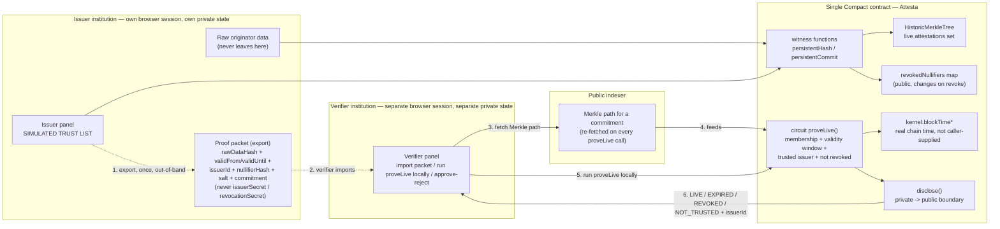

# Attesta

**Attesta: reusable proof that a compliance verification still holds.**
*Ask for the fact. Not the file.*

[](https://shields.io/)
[](https://shields.io/)
[](./LICENSE)

Built on the [Midnight Network](https://midnight.network/) for the Midnight Buildathon
(Wave 1).

---

## Why this exists

The SWIFT KYC Registry already lets close to **6,000 financial institutions and 60+
central banks, across 200+ countries**, verify a correspondent once and reuse that
verification instead of re-collecting the same documents — but it's closed
infrastructure, open only to Registry members. And on the rule that most directly tests
reuse *between* institutions — the FATF Travel Rule (Recommendation 16) — the FATF's own
2026 report finds **83% of surveyed jurisdictions have legislated it, but only 40%
actually enforce it**. That's not primarily a legislative gap. It's an infrastructure
gap: reconfirming a verification is expensive enough that, most of the time, it just
doesn't happen.

Attesta is a living registry of reusable compliance attestations: a compliance officer
asks a partner institution to reconfirm a fact — sanctions clear, originator screened —
and gets an answer that's provably still valid *right now*, without ever receiving or
storing the file behind it. The raw data behind an attestation never leaves the issuer's
side; only a commitment and a validity window become public. Revocation is a first-class,
*live* state change — an attestation that verifies as `LIVE` can verify as `REVOKED` the
instant its issuer revokes it, with no page reload and no new request back to the issuer.

---

## How it works



1. **Register (issuer).** The issuer commits an attestation — a `persistentCommit` of the
   record, never the raw document — as a leaf of a `HistoricMerkleTree` of live
   attestations. The raw data never leaves the issuer's machine.
2. **Export the proof packet, once, out-of-band.** The issuer hands the verifier a proof
   packet — `rawDataHash`, `validFrom`/`validUntil`, `issuerId`, `nullifierHash`, `salt`,
   and the already-public `commitment` (needed only to locate the right leaf in the
   indexer) — everything the verifier needs to run the proof itself, later, as many times
   as it wants. `issuerSecret`/`revocationSecret` — the secrets that let someone *mint or
   revoke* attestations as the issuer — never leave the issuer's side and never enter the
   packet.
3. **Verify, locally, repeatedly (verifier).** The verifier imports the packet, fetches
   the *current* Merkle path for that commitment from the public indexer, and runs
   `proveLive` on its own — proving membership in the live-attestations tree, a valid
   window, and a trusted issuer — without depending on the issuer being online, or paying
   for the check, ever again.
4. **Revoke.** The issuer adds the attestation's nullifier to the public
   `revokedNullifiers` map. `proveLive` checks this map on every call — a revoked
   attestation fails instantly, for every verifier who has ever imported its packet, with
   no coordination needed between them.
5. **`disclose()` is the only boundary.** Any witness value that reaches the public
   ledger or a circuit's return value has to pass through an explicit `disclose()` — its
   absence is a compile-time error category ("Witness and Disclosure Errors"), not a
   runtime bug a reviewer might miss.

---

## What the five official Midnight repositories don't cover

| Repository | What it demonstrates | What it doesn't cover |
|---|---|---|
| [`example-zkloan`](https://github.com/midnightntwrk/example-zkloan) ("ZK Loan") | A single privacy-preserving credit decision — credit data stays on the applicant's machine, only the loan outcome lands on-chain | One fact, proved once. No revocation of a past decision, and no path for a *second, independent* institution to reuse that same proof later. |
| [`midnight-did`](https://github.com/midnightntwrk/midnight-did) | A reference `did:midnight` method — Compact contract, DID domain model, TypeScript API | Identifier resolution, not the lifecycle of a fact asserted *about* an identity — no notion of an attestation going stale or being revoked. |
| [`midnight-verifiable-credentials`](https://github.com/midnightntwrk/midnight-verifiable-credentials) | The W3C issuer → holder → verifier structure for a verifiable credential | Reuse across *multiple, independent* verifiers who are neither the issuer nor the original holder — the credential model assumes the holder re-presents it each time, not that a second verifier reconfirms a prior verifier's check. No live-revocation state a verifier can watch update in real time. |
| [`midnight-trust-registry`](https://github.com/midnightntwrk/midnight-trust-registry) | The piece that would, in principle, answer "who is a legitimate issuer" | Created 2026-05-18, weeks before the hackathon, with no README or substantial public description we could find — maturity unknown, not confirmed production-ready. Even mature, it answers issuer trust, not revocation-with-live-state or cross-verifier reuse. |
| [`midnight-passport-sdk`](https://github.com/midnightntwrk/midnight-passport-sdk) | Binding a proof to a physical identity document (e.g. a passport) | A one-time binding to a document, not an ongoing, reusable, revocable attestation a third-party institution can reconfirm months later. Created 2026-07-30, similarly unconfirmed maturity. |

None of the five implements what Attesta's contract does: a `HistoricMerkleTree` of live
attestations whose membership a verifier can re-check at any time, paired with a public
nullifier set that a revocation writes to — so "this attestation, issued months ago, is
still good" (or isn't) is a fact anyone holding the proof packet can check for
themselves, indefinitely, without asking the issuer again.

---

## What's simulated in this demo

Binary rule we hold ourselves to: a list here is labeled `SIMULATED` identically on
screen, in this README, and in the video — or the phrase "reuse across institutions"
doesn't appear anywhere in our submission material. There is no in-between.

- **`SIMULATED TRUST LIST`** — the issuer panel's set of trusted issuers is a small demo
  list of fictitious institutions, labeled `SIMULATED TRUST LIST` on screen
  (`IssuerPanel.tsx`). Real issuer governance — who decides an institution is
  trustworthy — is not solved in this Wave (see Limitations below).
- **`DEMO PARTICIPANT`** — every counterparty named in the demo (the institution an
  attestation is *about*) is fictitious, labeled `DEMO PARTICIPANT` next to its name
  everywhere it appears.
- **`SIMULATED SANCTIONS LIST`** — the issuer's "type of verification" field includes
  "Sanctions screening (OFAC/EU/UN lists)" as one of the compliance checks an attestation
  can represent. Selecting it shows a `SIMULATED SANCTIONS LIST` badge and an explicit
  note that the check is not connected to any real OFAC/EU/UN list — it's a demo dataset
  only, not a live feed.

Any claim of "reuse between institutions" in this README refers only to what the demo
actually shows — one issuer, one verifier, real transactions, real proofs, against a
local devnet — not to a real second institution using Attesta today (see the next two
sections).

---

## What we haven't solved yet

Renata — the head-of-risk/CCO persona whose sign-off this product ultimately needs —
asks the question we can't yet answer: *"If I accept this proof instead of doing my own
diligence, who's on the hook if it's wrong — and how do I audit the verifier who
validated it?"*

We don't know yet. Wave 1 answers "is this specific attestation still live" — it does
not answer "did the *process* that produced hundreds of these attestations actually
follow policy." That's a real gap, not a rounding error, and it's a direct reason
Business Dev & Viability is the weakest part of this project's own internal review (see
Limitations below).

The concrete plan, not a vague promise: in Wave 2, Attesta will add an audit layer built
on the same commitment/Merkle primitives already shipped in Wave 1 — no rewrite. Each
time a verifier does a check, it will generate a private receipt (a checklist item, a
declared risk level, an outcome, a timestamp, committed the same way an attestation is
committed today) and accumulate those receipts in a `HistoricMerkleTree` per period. An
auditor will then be able to request a single proof that an entire batch of N receipts
satisfied a declared policy (e.g. "risk above this threshold implies enhanced due
diligence was applied") — without opening any individual case. That answers Renata's
question partially, not completely: a single, fixed policy is a proof of concept for a
*class* of policy, not a general answer to "who audits the verifier."

---

## Limitations

The same list, word for word wherever possible, in this README, in the video, and in the
submission form:

1. The trusted-issuer list and the sanctions list are `SIMULATED`. Real issuer governance
   is not resolved in this Wave.
2. The question "who audits the verifier?" (Renata, our blocking persona) is not answered
   in Wave 1. The sketch of an answer — the audit layer described above — is declared
   roadmap for Wave 2, on the same cryptographic core, not a vague promise.
3. No institution, auditor, or regulator was contacted at any stage of this project, up
   to the writing of this document. It is the direct reason for the failing grade this
   project's own internal review gave itself on Business Dev & Viability (4/10) — not a
   stylistic variation in grading, a test applied honestly. A concrete task to reduce,
   even partially, this gap before Wave 1 closes is part of this project's plan; if it
   wasn't possible in time, this limitation stands exactly as written here.
4. Attesta's network-effect argument (parallel to the SWIFT KYC Registry) is a thesis,
   not a demonstrated fact, for as long as there is no at least one real adoption signal
   outside the team.
5. `midnight-trust-registry` and `midnight-passport-sdk` have unknown maturity — created
   weeks before the hackathon, with no README or substantial description we could find.
   Any future integration with them depends on a maturity confirmation not yet made.
6. The named comparison with the Hack Buenos Aires winners (7–8 Aug 2026: Blockenfy,
   Gracias Esteban, Raccoons) has not been verified in detail — their demo video had not
   been watched as of the writing of this document.
7. The "why on this infrastructure specifically" defense is weaker for the future audit
   layer (Wave 2) than for Attesta itself (Wave 1) — a constant-size proof is not, by
   itself, Midnight-specific (other ZK-native chains also produce constant-size proofs).
   What's left as a defense is development cost, not an exclusive cryptographic property.
8. The issuer panel received the minimum UX budget, by conscious decision — UX time went
   to the verifier panel, which is what this product's core emotional journey (and the
   UX judging criterion) needs most.
9. Neither panel has been tested with a real user, fictitious or not, as of the writing
   of this document.
10. The exact end time of the Wave 1 build remains an inference (00:00 JST / 15:00 UTC on
    16 Sep 2026, symmetric to the start time) — AKINDO had not published the exact time
    as of the writing of this document.

---

## Attesta — status of this repository (Bloco 0)

**Attesta** is a living registry of reusable compliance attestations, built for
the Midnight Buildathon (Wave 1). It was scaffolded from the **official Midnight
`bboard` example** — the contract, API and UI have since been fully adapted to
Attesta's own domain (attestation registration, revocation, `proveLive`, the
issuer→verifier proof-packet handoff). This section documents the environment
setup, verified to work end-to-end against the real Attesta contract, not the
original bulletin-board example.

**Attribution to the Midnight ecosystem tooling used as the starting point:**
- Scaffolded with [`create-mn-app`](https://www.npmjs.com/package/create-mn-app)
  (`npx create-mn-app@latest`), the official Midnight Network project generator.
- Starting template: [`bboard`](https://github.com/midnightntwrk/example-bboard)
  (Bulletin Board), chosen as the closest structural match to Attesta — a ZK
  identity/attestation-style proof, a CLI, and a React UI.

### Reproducible setup (devnet local — network `undeployed`)

Attesta's primary network until the Wave 1 feature cutoff (2026-09-08) is the
**local devnet** (`undeployed`), not `preview`/`preprod`. Everything below runs
fully offline against Docker containers on your machine — no wallet, no faucet,
no testnet tokens required.

**Prerequisites** (verified in this environment):

| Requirement | Verified version | Notes |
|---|---|---|
| Node.js | v24.14.1 (≥ 22 required) | `node --version` |
| Docker | 28.5.1 | `docker --version` — daemon must be running |
| Docker Compose | v2.40.2 (**v2 required**) | `docker compose version` |
| Compact compiler | **0.31.1** | Installed via `compact update 0.31.1` (see below); matches `@midnight-ntwrk/compact-runtime@0.16.0` pinned in `package-lock.json` — the version pair this repo's contract was compiled and tested against |

**1. Install the Compact toolchain manager, then the compiler:**

```bash
curl --proto '=https' --tlsv1.2 -LsSf \
  https://github.com/midnightntwrk/compact/releases/latest/download/compact-installer.sh | sh
compact update 0.31.1
compact compile --version   # expect: 0.31.1
```

> If `compact update` fails with an extraction error, your environment is
> likely missing `unzip` — the compiler artifact ships as a `.zip`. Install
> `unzip`, or extract `~/.compact/versions/<version>/<target>/artifact.zip`
> manually into that same directory and `chmod +x` the extracted binaries.

**2. Install dependencies (npm workspaces, run once from the repo root):**

```bash
npm install
```

**3. Compile the contract and build the workspaces judges need:**

```bash
cd contract && npm run compact && npm run build && cd ..
cd api && npm run build && cd ..
cd bboard-ui && npm run build && cd ..
```

Expected: `Compiling 4 circuits:` (`registerAttestation`, `revokeAttestation`,
`proveLive`, `setTrustedIssuer`), no errors, and
`contract/src/managed/attesta/{keys,zkir}` populated with prover/verifier keys.
(`bboard-cli/src/index.ts` — the original bulletin-board interactive menu — is
intentionally left unbuilt; see the note under "Bring up devnet local" below.)

**4. Run the automated test suite:**

```bash
cd contract && npm run ci
```

Expected: **14 tests passing**, plus a separate `pretest` check that a witness
value leaking without `disclose()` fails at **compile time** (not a vitest
case — it's a standalone script, `src/test/verify-leak-fails-to-compile.mjs`,
wired as `pretest`). `npm run ci` also runs `typecheck`, `lint`, and `build` —
it's the same command judges can run end-to-end to verify the submission. For
just the test suite: `cd contract && npm test -- --run`.

**5. Bring up devnet local + proof server:**

```bash
cd bboard-cli
npm run standalone
```

This single command starts the **local node, indexer and proof server** as
Docker containers (via `testcontainers`, using `bboard-cli/compose.yml` —
Docker Compose v2 under the hood). No manual `docker compose up` step is
needed. First run pulls three images (~1.5 GB total: `midnight-node`,
`indexer-standalone`, `proof-server`) and takes roughly 90 seconds to reach a
ready state; subsequent runs reuse the cached images and start faster.

The command prints the resulting endpoints (node RPC, indexer GraphQL/WS,
proof server, all on `networkId: "undeployed"`) and then **stays running** —
it does not open an interactive menu and does not shut the devnet down on its
own. Leave it running in its own terminal, then in a second terminal bring up
the web app against it: `cd bboard-ui && npm run dev`. Press `Ctrl+C` in the
`standalone` terminal when you're done; containers are torn down automatically
(via the `testcontainers` Ryuk reaper) on exit.

> **Note on `bboard-cli`'s interactive menu (`src/index.ts`):** the original
> `bboard` template CLI menu (`post`/`takeDown`/deploy-or-join prompts) still
> imports contract/API symbols from before the Attesta rename
> (`BBoardAPI`, `BBoardProviders`, etc.) and does not build. It is not used by
> `npm run standalone` (see `src/launcher/standalone.ts`, which only starts the
> devnet and prints its endpoints) and is not needed to test Attesta — the
> `bboard-ui` web app is the intended way to exercise issuer/verifier flows.
> Porting that menu to Attesta's vocabulary was deliberately out of scope here.

### Testing manually with Lace on the local devnet (`Undeployed` network)

To click through the Attesta web app by hand (issuer panel, verifier panel)
against the local devnet started above, you need a Lace wallet with funds on
Lace's **Undeployed** network. A wallet you create fresh starts with **0
DUST/NIGHT** and cannot submit any transaction — there is no faucet for
`undeployed`, since it only exists on your own machine.

Instead, import the **genesis wallet seed** — a fixed, publicly-known seed
that has access to the tokens minted in the genesis block of every local
Midnight devnet. It is defined in `bboard-cli/src/index.ts`:

```ts
// This seed gives access to tokens minted in the genesis block of a local
// development node - only used in standalone networks to build a wallet
// with initial funds.
const GENESIS_MINT_WALLET_SEED =
  '0000000000000000000000000000000000000000000000000000000000000001';
```

This is **not a secret** — it is public, it only ever has value on a local
devnet you started yourself, and every Midnight developer using `bboard`-style
standalone tooling uses the same seed. It has no value or meaning on
`preview`/`preprod`/mainnet.

**Steps:**

1. Make sure `npm run standalone` (above) is running and has printed its
   endpoints.
2. Open the Lace wallet extension, and either create a new wallet or restore
   one from a seed — choose **restore from seed** and paste the genesis seed
   above.
3. Set Lace's **Network** to **Undeployed**.
4. Set Lace's **Proof server** to `http://127.0.0.1:6300` — `bboard-cli/compose.yml`
   pins this port (along with `9944` for the node and `8088` for the indexer) so it
   matches Lace's own default for the "Undeployed" network without any extra
   configuration.
5. The wallet should now show a large NIGHT/DUST balance from the genesis
   block, funded and ready to sign transactions against the local devnet —
   no faucet step needed.
6. With `bboard-ui`'s dev server running (`cd bboard-ui && npm run dev`, which
   defaults to `VITE_NETWORK_ID=undeployed` via `bboard-ui/.env`), open the
   app and connect this Lace wallet.

### Gas note — DUST, not NIGHT

Transactions are paid for in **DUST**, a shielded, non-transferable resource
that decays over time and is generated by *delegating* NIGHT — not by holding
NIGHT itself. Before treating any "transaction failed to submit" symptom as a
contract or connectivity bug, confirm the wallet in use has a non-zero DUST
balance for the target network. On devnet local (`standalone`), this is
handled by the environment's own genesis/minting flow; on `preview`/`preprod`,
DUST must be generated explicitly from the wallet's **Tokens** screen after
funding with tNIGHT from the faucet (see "Lace Wallet Extension" above).

### First diagnostic for "nothing works"

Before investigating application logic, check, in this order:
1. **Compiler/runtime version match** — does `compact compile --version` say
   `0.31.1`, matching `@midnight-ntwrk/compact-runtime@0.16.0` in
   `package-lock.json`? A mismatch here produces runtime errors with no
   obvious connection to the actual cause.
2. **DUST balance** — see above. No DUST, no submitted transaction, no
   deployed contract — regardless of NIGHT balance.

---

## Project Structure

```
attesta/
├── contract/               # The Compact contract (registerAttestation, revokeAttestation,
│   └── src/                # proveLive, setTrustedIssuer) — a single contract, see "Why one
│                           # contract" below. Also the witness functions, private-state
│                           # shape, and the automated test suite.
├── api/                    # AttestaAPI — the typed layer both the CLI and the UI call
│                           # (deploy/join, one method per circuit, proof-packet
│                           # export/import, the live ledger observable).
├── bboard-cli/             # Brings up the local devnet + proof server (`npm run standalone`).
│   └── src/                # Its original interactive post/takeDown menu is unused and
│                           # unbuilt — see the note under "Testing manually with Lace" above.
└── bboard-ui/               # The web app — issuer panel and verifier panel.
    └── src/                 # Folder names (`bboard-cli`, `bboard-ui`) are inherited from the
                              # `bboard` scaffold this repo started from; the contract, API,
                              # and UI logic inside them are Attesta's, not the bulletin board's.
```

> **Why a single Compact contract, not several:** cross-contract calls are not supported
> by Compact's ZKIR today. Splitting issuer/verifier/trust logic into separate contracts
> isn't a style choice available here — it's a documented compiler limitation, so
> everything (registration, revocation, `proveLive`, issuer trust) lives in one contract
> by design.

## Useful links

- [Midnight Documentation](https://docs.midnight.network/) — the developer guide for the
  platform Attesta is built on.
- [Compatibility Matrix](https://docs.midnight.network/relnotes/support-matrix) —
  currently supported Midnight component versions.
- [Compact Language Guide](https://docs.midnight.network/compact/writing) — smart
  contract language reference.
- Lace wallet: [Chrome Store](https://chromewebstore.google.com/detail/lace/gafhhkghbfjjkeiendhlofajokpaflmk)
  or [Edge Store](https://microsoftedge.microsoft.com/addons/detail/lace/efeiemlfnahiidnjglmehaihacglceia).

## Troubleshooting

For the primary path (local devnet, `undeployed` network), see "First diagnostic for
'nothing works'" above — start there before anything below.

| Common issue | Solution |
| --- | --- |
| `npm install` fails | Ensure you're using Node `v24.11.1` or newer (see `.nvmrc`). Older Node versions can install with warnings but are not the target runtime. |
| Contract compilation fails | Confirm the Compact toolchain is installed and matches `compact compile --version` → `0.31.1` (see "Reproducible setup" above), then run `npm run compact` from `contract/`. |
| Lace wallet not detected / "did not respond" on first connect | Refresh the page and retry — the wallet extension's background worker can be cold on first load. If it persists, confirm you're on **Undeployed** network with the proof server address printed by `npm run standalone`. |
| Docker issues | Ensure Docker Desktop is running (`docker --version`), and that `bboard-cli/compose.yml`'s ports (9944, 6300, 8088) aren't already in use by something else. |
| Transaction never submits, no error | Check the wallet's **DUST** balance, not NIGHT — see "Gas note" above. Zero DUST means zero submitted transactions, regardless of NIGHT balance. |
| Dependencies won't install | Use a Node.js LTS version matching `.nvmrc`. For older npm versions you may need `--legacy-peer-deps`. |

## Implementation notes

- **Transaction fee configuration.** The default `additionalFeeOverhead`
  (`500_000_000_000_000_000n`) from `@midnight-ntwrk/testkit-js` is required on the
  `undeployed` network — lower values can fail with `BalanceCheckOverspend` on the node
  side.
- **Private state is stored per contract address**, matching the `Midnight.js 4.x`
  private-state provider model. The issuer panel and the verifier panel each hold their
  own, separate private state — see "How it works" above (D27): a verifier never has
  access to an issuer's secrets, only to what it imported in a proof packet.
