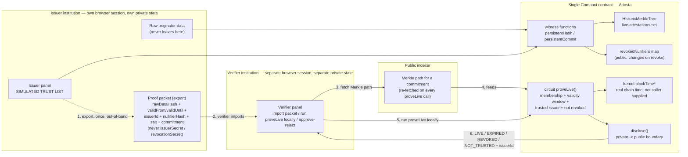
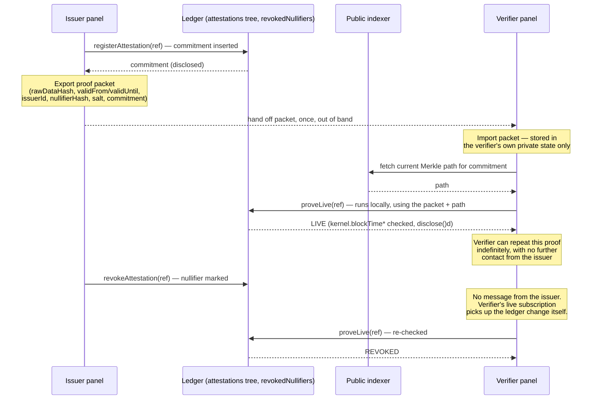
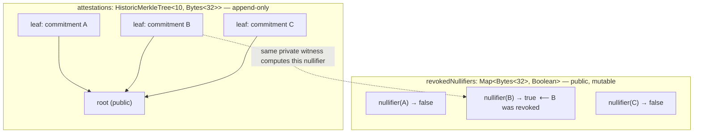

# Architecture

## The same cycle, in time

The diagram above shows components and data flow; this shows the order events actually
happen in, across two independent identities and one ledger neither of them controls
alone:

The two calls to `proveLive` in this diagram are the same call, run twice, by the same
party, with no issuer involvement in either — that repeatability without re-asking is
the entire point of calling this a *reusable* proof rather than a one-time credential
check.

## Why revocation doesn't move the tree

`HistoricMerkleTree` in this Compact/runtime version supports insertion and membership
checks — confirmed by compiling minimal snippets against the real toolchain before
writing the contract — but not in-place removal. So revoking commitment B never touches
the tree or its root; it flips one entry in a completely separate public map, keyed by a
value only someone holding B's own private witness data could ever compute. Watching
`revokedNullifiers` from the outside shows "one entry changed" — never which leaf it
corresponds to, which issuer signed it, or what it concerned.

## Why a single Compact contract

Compact's ZKIR does not support cross-contract calls today. Splitting issuer, verifier,
and trust logic into separate contracts wasn't a design option available here — it's a
documented compiler limitation, confirmed early enough to shape the design from the
first line, not discovered halfway through the build. Every circuit
(`registerAttestation`, `revokeAttestation`, `proveLive`, `setTrustedIssuer`) lives in
one file, `contract/src/attesta.compact`, by design.

## Components

| Component | Owns | Why it exists |
|---|---|---|
| **Compact contract** | Registers, revokes, and proves membership of attestations without exposing which one | The mechanism itself — the piece that answers "does this attestation still hold?" as live state, not a static credential |
| **`HistoricMerkleTree` of live attestations** | The one public artifact representing "every attestation ever registered" | Membership proofs without revealing the specific member. Chosen after confirming empirically that the tree type supports insertion but not in-place removal — this is *why* revocation is a separate nullifier map, not a design preference |
| **`revokedNullifiers` map** | The live/revoked status of each attestation, keyed by a value only computable by someone holding that attestation's private witness data | The artifact that actually changes when `revokeAttestation` runs. A bare diff of this map shows only "some nullifier flipped," never which attestation, which issuer, or which tree leaf |
| **`trustedIssuers` map** | The `SIMULATED TRUST LIST` flag | Governance of who counts as a legitimate issuer is an explicitly unresolved product question this Wave — see [Limitations](/limitations) |
| **`AttestaAPI`** | The typed layer both the CLI and the UI call — one method per circuit, the proof-packet export/import, a live observable over ledger state | Keeps the two panels from having to know Compact-runtime plumbing directly |
| **Issuer panel** | Seeding and revoking demo attestations, exporting the proof packet | Deliberately minimal UX budget — see [Demo Walkthrough](/demo-walkthrough) for why the verifier side got the time instead |
| **Verifier panel** | Importing a packet, running `proveLive` independently, showing the live/expired/revoked distinction, approve/reject | This is where the product's actual argument lives — it's what makes the privacy guarantee *visible*, not just asserted |

## Two genuinely separate identities, not a UI convention

The issuer and verifier panels each own their own private-state provider and their own
wallet connection — never shared, never a fallback from one to the other. This matters
mechanically, not just narratively: a verifier that hasn't imported a proof packet for a
given attestation gets a real error trying to call `proveLive` on it — there's no
silent read from the issuer's in-memory state to paper over a missing import. This was
confirmed by construction and by a deliberate negative test (see [Tests](/tests)) before
being treated as done.

## The proof-packet handoff, and why it isn't a design shortcut

An earlier design had the *verifier* calling `proveLive` directly, with no defined
channel for the private witness data it would need to do that. A later design
considered having the *issuer* run `proveLive` on every verification request instead —
rejected for three concrete reasons: it makes the issuer a required-availability
dependency for reconfirming even old, already-valid attestations; it makes the issuer
pay gas for verifications requested by institutions that aren't even its own customers;
and it breaks the core promise of a *reusable* proof — every reconfirmation would become
a fresh request back to the issuer. The proof-packet handoff — issuer exports once, out
of band, verifier proves locally and repeatedly, forever, without the issuer's continued
involvement — is the design that survived that comparison. See
[Compact Contract](/compact-contract) for the specific witnesses (`issuerIdWitness`,
`nullifierHashWitness`) that make this possible without ever handing the verifier the
issuer's signing secret.

## Real chain time, not a caller-supplied clock

`proveLive`'s validity check originally took `currentTime` as a plain circuit argument —
trivially spoofable, since a dishonest caller could simply assert whatever "now" produced
a `LIVE` result. It was replaced with `kernel.blockTimeLessThan`/`blockTimeGreaterThan`,
reading the real time of the block the transaction lands in. The trade-off, stated
plainly rather than glossed over: both `kernel` calls are ledger operations, so their
argument must pass through `disclose()` to be called at all — meaning `proveLive` now
discloses `validFrom`/`validUntil` themselves on every call, not just the pass/fail
result. That's an acceptable cost, because the validity window was already committed as
public state at registration time (see [Compact Contract](/compact-contract)) — nothing
new is exposed by this that wasn't already public from the moment the attestation was
registered.
