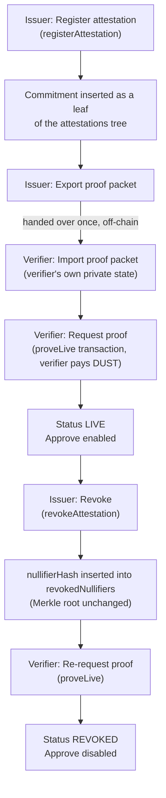

# User Flow

This walks the same cycle described in [What It Does](/what-it-does), but through the
two real screens (the issuer panel and the verifier panel) and a named scenario, the way
it's actually demonstrated.

## Before: no product

Table 2 reconstructs Priya's day without the product.

**Table 2: Priya's day before Attesta**

| Time | What happens | What she feels |
|---|---|---|
| 09:00 | A large transaction triggers the Travel Rule threshold with a partner VASP | Routine |
| 09:15 | She realizes she only has two options: ask for more data than she needs, or stall the client | Tension |
| **10:00** | She formalizes the request for the full originator dossier, knowing it violates the minimization principle she'd cite to an auditor | **Professional shame: the low point of the day** |
| 12:00 | Waits for the partner to assemble and send the document package | Anxiety: she's the client's bottleneck |
| 14:30 | Receives a PDF with a name, an address, data she didn't need to see | Now responsible for protecting data that isn't hers |
| 16:00 | Approves the transaction based on the full dossier | Resignation |
| 17:00 | Files the dossier, knowing the next transaction with the same partner repeats the whole thing | Fatigue |

*Source: the authors (2026).*

## With Attesta

Flowchart 2 shows the whole cycle across both panels; the steps below walk through it.

**Flowchart 2: the issuer registers and exports, the verifier proves, the issuer revokes**

*Source: the authors (2026).*

### Step 1: Register (issuer side, once)

The issuer's compliance team opens the **issuer panel**, connects an institutional
wallet, and registers an attestation: a counterparty label, a verification type
(e.g. "Sanctions screening: OFAC/EU/UN lists"), and a validity window. The panel is
intentionally minimal: most of the UX budget in this project went to the verifier
side, because that's where the decisive moment lives. A visible `SIMULATED TRUST LIST`
badge marks that the demo's list of trusted issuers is illustrative, not a live
governance process (see [Limitations](/limitations)).

### Step 2: Export the proof packet, once, out of band

The issuer clicks **Export proof packet**. This produces a small bundle (never the
underlying document, never the issuer's signing secret) that the verifier will use to
prove liveness on its own, indefinitely, without asking the issuer again. It's handed
over exactly once, the same way a physical seal or reference number would be shared
between two institutions today, over whatever channel the two institutions already use
to talk to each other.

### Step 3: Verify, locally (verifier side, Priya's 09:25)

Priya opens the **verifier panel**, connects her own institution's wallet (a genuinely
separate identity from the issuer's; the two panels never share private state), pastes
the proof packet, and clicks **Request proof**. Her machine (not the issuer's, not a
third party's) fetches the current Merkle path from the public indexer and runs the
`proveLive` circuit locally. The result renders in under a few seconds:

- A status: LIVE,
  EXPIRED,
  REVOKED, or `NOT_TRUSTED`.
- The validity window, shown as public data.
- A visibly redacted field where the underlying document would be, captioned literally:
  **"Raw data not received, by design."** This is the visual proof of the guarantee,
  not a placeholder for a bug: the compliance file was never sent, and the empty field
  says so instead of just looking broken.

She approves or rejects based on that result, having never received or stored a third
party's personal data.

**Figure 3: the verifier requests a proof and receives LIVE, with the raw file never sent**

*Source: the authors (2026).*

### Step 4: Revoke, and watch it propagate live

If the issuer later revokes the attestation (the underlying screening turned out to be
wrong, or the counterparty relationship ended), the verifier panel updates
**automatically**, without a page reload and without a new request back to the issuer:
`LIVE` becomes `REVOKED` the instant the revocation transaction lands. This is the
argument this project treats as central, not decorative: revocation as *live public
state*, not a promise printed on a certificate.

**Figure 4: after the issuer revokes, the verifier proves again and the chain answers REVOKED**

*Source: the authors (2026).*

## After: with Attesta

Table 3 shows the same day with the product in place.

**Table 3: Priya's day with Attesta**

| Time | What happens | What she feels |
|---|---|---|
| 09:00 | Same threshold triggers | Routine |
| 09:15 | Requests only the fact the rule requires | Relief: no more choosing between over-collecting and stalling |
| 09:20 | Receives the proof, no underlying document | Cautious surprise |
| **09:25** | Confirms the proof isn't expired or revoked, without seeing raw data | **Confidence: the peak of the day** |
| 09:30 | Approves without custodying anyone else's PII | Lightness |
| End of day | No dossier to protect, no inherited exposure | Durable sense of control |

*Source: the authors (2026).*

See [Architecture](/architecture) for the same cycle as a sequence diagram (Flowchart 4), and
[Demo Walkthrough](/demo-walkthrough) for the exact screens and clicks, as actually
tested end to end.
